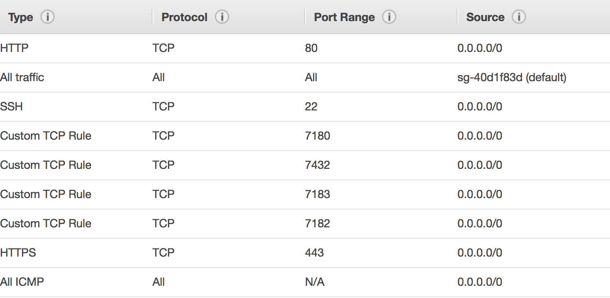
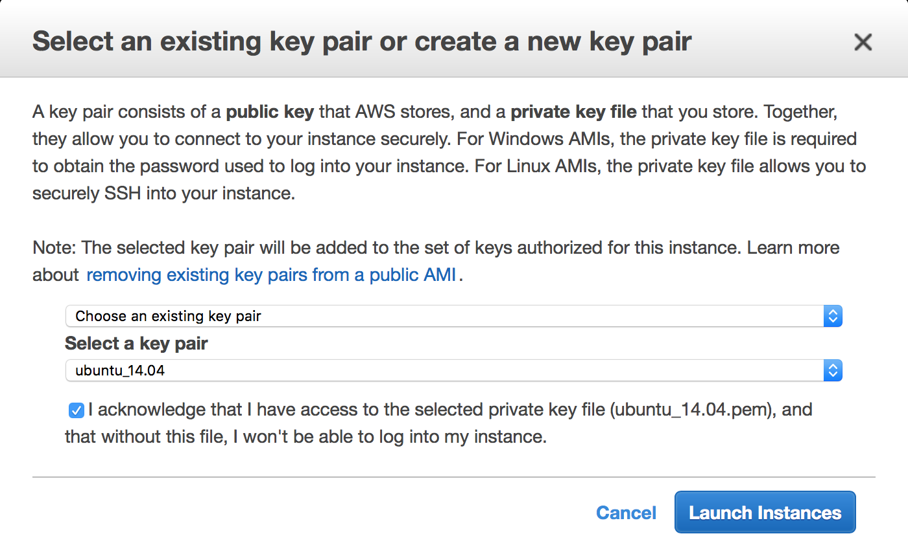
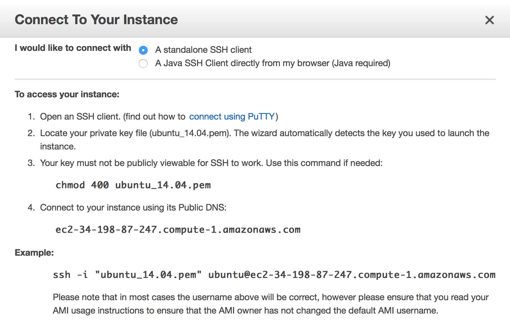

# CDH: Installation Path A
This repository contains the steps I took to install CDH on Amazon EC2 instances using Install Path A

1. Logged into my AWS account
2. Locked into U.S. East (N. Virginia)
3. Created a public/private key pair according to these instructions: http://docs.aws.amazon.com/AWSEC2/latest/UserGuide/ec2-key-pairs.html
4. Security group creation should be done before the instance configuration.  See the setup I have for the default group which allows the inbound ports specified for the Cloudera installation.



5. Go to the EC2 Dashboard and select __Launch Instance__. 
6. Choose __Ubuntu Server 14.04 LTS (HVM), SSD Volume Type - ami-5ac2cd4d__. 
7. For __Choose an Instance Type__, pick something like __m3.xlarge__, based on my experience (found an hs_err_pid file in the temp directory indicating that memory had been exhausted) and the confirmation by someone else:

  _I have chosen ”m3.xlarge (4 vCPUs, 2.5 GHz, Intel Xeon E5-2670v2, 15 GiB memory, 2 x 40 GiB Storage Capacity)” for my instance type which is NOT FREE of cost. Because when I have chosen low configure free tier eligible instance type, the server silently going down during installation._
8. For __Configure Instance Details__, create 4 instances; leave all other fields at their default values.
9. On the __Add Storage__ page, assign 30 GiB as the value.
10. Leave the __Add Tags__ blank; those are assigned later.
11. On __Configure Security Group__, choose _Select an_ _**existing**_ _security group_ and select the one created in an earlier step.
12. When you click the __Launch Instance__ button, you are prompted to launch the instance with a key pair, as shown below:



13. The instances are automatically assigned values for Public/Private DNS and Public/Private IP.
14. In the __Name__ column, click the pencil icon to edit the name.  Create _NameNode_, _DataNode1-3_.
15. On the left-hand side, click __Elastic IPs__.
16. Click the __Allocate new address__ button.
17. Then click the __Allocate__ button to the far right; do that 3 more times.
18. Then click __Actions__ and associate the IPs with running instances; do that 3 more times.  __Note:__ Order doesn't matter.
19. Click the __NameNode__ and the __Connect__ button lights up.  Click that.



20. scp notes:

## Command
```
  scp -i ~/Downloads/ubuntu_1404.pem ./cloudera-manager-installer.bin ubuntu@ec2-54-88-19-45.compute-1.amazonaws.com:~
```
## Comments

<pre>
  1. The example Amazon gives is for an EC2 Instance.  I’m using Ubuntu, so the user is not ec2-user but ubuntu.  
  2. This page gives a good explanation of the problem:  
    http://stackoverflow.com/questions/17449023/transferring-a-file-to-an-amazon-ec2-instance-using-scp-always-gives-me-permissi
</pre>
